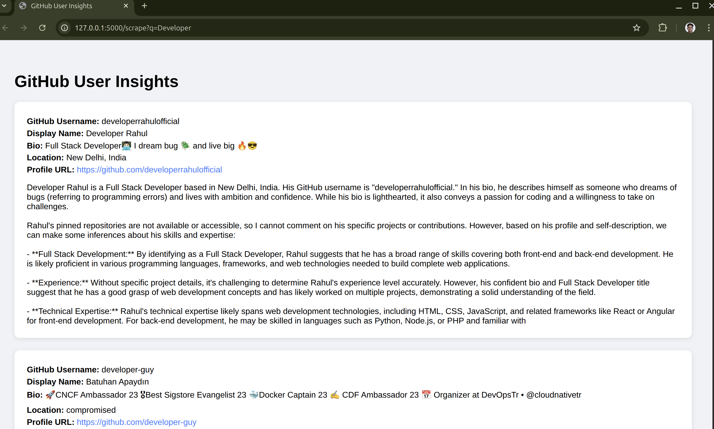
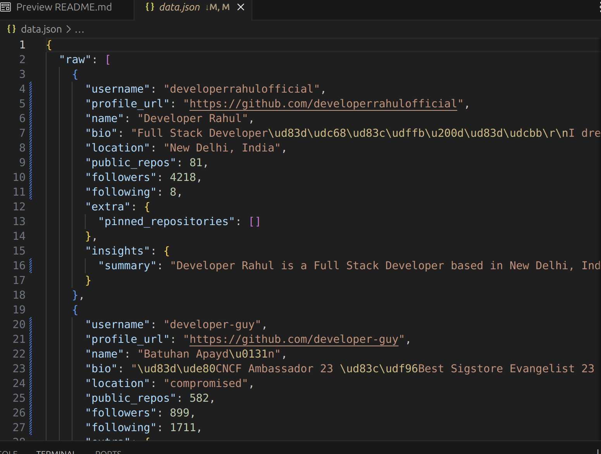

# 🔍 GitHub Insight Service

A Flask-based web application that scrapes GitHub profiles based on a search query and summarizes developer insights using Cohere's language model API.
## Project Structure


```bash
github_insight_service/
├──README.md                       # Project overview
├── app.py                           # Main Flask app with logging & routes
├── requirements.txt                 # Python dependencies
├── Dockerfile                       # Docker build file for the Flask app
├── docker-compose.yml              # Compose file to run app + optional DB
├── logs/
│   └── app.log                      # Request/response logs (auto-created)
├── github_scraper.py               # Your GitHub scraping logic
├── ai_processor.py                 # AI/LLM-based summarization
├── storage.py                      # Data storage logic (DB or JSON)
└──templates/
   └── results.html                # Renders enriched GitHub user insights


```
## Response

### Web Page Preview


### Json File Preview


---

---

## 🔧 Tech Stack

- **Backend**: Python, Flask  
- **Web Scraping**: GitHub Search + Requests  
- **AI Summarization**: Cohere API   
- **Data Handling**: JSON  
- **Storage**: Local filesystem (`data.json`)  

---

## ⚙️ Setup Instructions

### 1. Clone the Repository

```bash
git clone https://https://github.com/CodeWhizAfsal/github_insight_service
cd github_insight_service
```
### 2. Create Virtual Environment
```bash
python3 -m venv env
source env/bin/activate  # On Windows use: env\Scripts\activate
```

### 3. Install Dependencies
```bash
pip install -r requirements.txt
```

**Example `requirements.txt`:**
```text
flask
requests
beautifulsoup4
cohere
```

---

## 🧰 Tech Stack Used

- **Python 3.12**
- **Flask** – Web application framework  
- **BeautifulSoup** – Web scraping GitHub profiles   
- **Cohere** –  for AI-based summarization  
- **Jinja2** – HTML templating engine for Flask  
- **JSON** – For internal data storage and caching  

---

## 🤔 Assumptions Made

- GitHub user data can be publicly scraped based on keyword search.
- The keyword query returns enough users to populate insights meaningfully.
- AI summarization is handled either via cohere.
- File `data.json` is used to  store results .

---

## 🚀 Running Locally

### Start Flask App
```bash
python app.py
```

By default, this runs at:

[http://127.0.0.1:5000/scrape?q=keyword](http://127.0.0.1:5000/scrape?q=Developer)

### Using the Web UI

1. Navigate to `/` in your url.
2. Enter a keyword (e.g., `"machine learning"`) to fetch.
3. For default I am using Developer as keyword
4. It will take some time to process.
5. Once it completed it will display the result on webpage and store it in json format.

---

## 📡 API Usage

This project exposes  API endpoints to scrape GitHub users, generate AI-powered insights, and return results in  structured JSON format.

---


### 🟨 `GET /scrape`

Fetch GitHub user profiles based on a keyword query and return enriched data in JSON format.

#### 🔧 Query Parameters

| Name | Type   | Required | Default Value         | Description                            |
|------|--------|----------|------------------------|----------------------------------------|
| `q`  | string | No       | "javascript developer" | Keyword used to search GitHub users    |

#### 📥 Example Request

```
GET /scrape?q=python+developer
```

#### 📤 Example JSON Response

```json
{
      "username": "developer-guy",
      "profile_url": "https://github.com/developer-guy",
      "name": "Batuhan Apayd\u0131n",
      "bio": "\ud83d\ude80CNCF Ambassador 23 \ud83c\udf96Best Sigstore Evangelist 23 \ud83d\udc33Docker Captain 23 \u270d\ufe0f CDF Ambassador 23 \r\n\ud83d\udcc5 Organizer at DevOpsTr \u2022 @cloudnativetr",
      "location": "compromised",
      "public_repos": 582,
      "followers": 899,
      "following": 1711,
      "extra": {
        "pinned_repositories": []
      },
      "insights": {
        "summary": "Batuhan Apayd\u0131n, known as \"developer-guy\" on GitHub, is a seasoned technologist with a strong background in cloud-native technologies and open-source software. He holds several prestigious titles and affiliations, indicating a high level of expertise and recognition within the tech community. \n\n**Main Skills and Technical Expertise:**\n- Cloud-Native Technologies: Apayd\u0131n is a certified expert in this field, as evidenced by his role as a CNCF (Cloud Native Computing Foundation) Ambassador. He advocates for and contributes to the advancement of cloud-native principles and technologies, such as containerization, microservices, and serverless computing.\n- Containerization: As a Docker Captain, he is an expert in Docker and containerization technologies. This title is awarded to individuals who are highly skilled in containerization, have made significant contributions to the Docker community, and actively promote Docker best practices.\n- .\n- Community Leadership: Apayd\u0131n is a CDF (Cloud Native Computing Foundation) Ambassador, which means he actively contributes to the cloud-native community, promotes best practices, and helps foster the growth"
      }
    },
```

---

### ✅ Summary

| Route         | Output Format | Use Case                     |
|---------------|----------------|------------------------------|
| `/api/scrape` | JSON           | Machine-readable REST API    |

## Project Structure


| Route         | Output Format | Use Case                     |
|---------------|----------------|------------------------------|
| `/scrape` | JSON           | Machine-readable REST API    |


